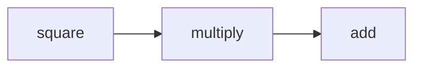

# impact-graph

> **"If I change this function, what breaks?"**  
> Change impact analysis powered by call graphs + PageRank.

[](https://github.com/phoenix-assistant/impact-graph/actions/workflows/ci.yml)
[](https://www.npmjs.com/package/@phoenixaihub/impact-graph)
[](LICENSE)

## What it does

`impact-graph` statically analyzes your TypeScript/JavaScript and Python codebase to build a call graph. It then answers: **"if I refactor this function, what else could break?"**

- 📊 **Call graph construction** — extracts function defs, calls, imports, class methods
- 🎯 **Impact analysis** — BFS traversal to find all transitively affected functions
- 🔥 **Risk scoring** — PageRank-based risk: highly-depended-on functions = highest risk
- 🔄 **Circular dep detection** — Tarjan's SCC algorithm
- 🌑 **Orphan detection** — functions defined but never called
- 🔀 **Git diff mode** — automatically analyze what changed in your current branch

## Install

```bash
npm install -g @phoenixaihub/impact-graph
# or
npx @phoenixaihub/impact-graph <command>
```

## Usage

### 1. Index your project

```bash
cd my-project
impact-graph index
```

```
🔍 Indexing project at /my-project ...
✅ Indexed in 312ms
   Files:     47
   Functions: 284
   Calls:     891
   Graph saved to .impact-graph/graph.json
```

### 2. Check impact of a function change

```bash
impact-graph check src/utils.ts:processPayment
```

```
⚡ Impact Analysis — 12 affected function(s)

┌────────────────────────────┬──────────────────────────────┬───────┬────────────┬─────────┐
│ Function                   │ File                         │ Depth │ Risk Score │ Callers │
├────────────────────────────┼──────────────────────────────┼───────┼────────────┼─────────┤
│ handleCheckout             │ src/checkout.ts              │ 1     │ 12.45      │ 3       │
│ processOrder               │ src/orders.ts                │ 2     │ 9.12       │ 2       │
│ sendConfirmationEmail      │ src/notifications.ts         │ 3     │ 4.33       │ 1       │
└────────────────────────────┴──────────────────────────────┴───────┴────────────┴─────────┘
```

**Flags:**
- `--depth <n>` — max traversal depth (default: 10)
- `--format json|table|markdown` — output format

### 3. Analyze your git diff

```bash
impact-graph check --diff
```

Automatically detects changed functions in staged + unstaged git diff and runs impact analysis on each.

### 4. Visualize the graph

```bash
impact-graph visualize --format mermaid
impact-graph visualize --format dot > graph.dot && dot -Tsvg graph.dot -o graph.svg
```

**Mermaid output (paste into GitHub/Notion):**


### 5. Codebase health stats

```bash
impact-graph stats
```

```
📊 Codebase Health Stats

  Functions: 284
  Calls:     891
  Files:     47

🔥 Top 10 Riskiest Functions (PageRank)

  processPayment                 14.23 risk    12 callers  src/payments/processor.ts
  validateUser                   11.87 risk     9 callers  src/auth/validate.ts
  ...

🔄 Circular Dependencies: 2
  ⚠ processOrder → validateCart → processOrder
  ⚠ formatDate → parseDate → formatDate

🌑 Orphan Functions (never called, never call): 7
  legacyExportCSV  (src/export.ts:142)
  ...

🔗 Most Coupled Modules (by outgoing calls)
  src/checkout.ts          34 calls out
```

## Supported Languages

| Language | Function defs | Calls | Imports |
|----------|--------------|-------|---------|
| TypeScript | ✅ | ✅ | ✅ |
| JavaScript | ✅ | ✅ | ✅ |
| Python | ✅ | ✅ | ✅ |

Go support coming soon.

## Algorithms

- **Call graph construction** — regex-based AST extraction (tree-sitter optional)
- **PageRank** — iterative PageRank (85% damping, 50 iterations). High rank = many callers = risky to change
- **Transitive closure** — BFS from changed node following reverse call edges
- **Circular dep detection** — Tarjan's SCC algorithm
- **Risk scoring** — `PageRank × 100 + depth_factor × 10`

## Development

```bash
git clone https://github.com/phoenix-assistant/impact-graph
cd impact-graph
npm install --legacy-peer-deps
npm run build
npm test
```

## License

MIT © PhoenixAI Hub
